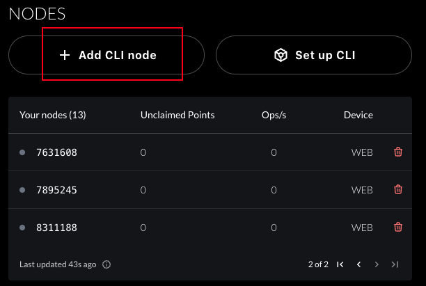

# web3-script

欢迎关注 `https://x.com/geekdogxy`

# 使用

## 更新 nexus 到 0.9.0 版本

```
curl https://cli.nexus.xyz/ | sh

nexus-network --version
# 返回 nexus-network 0.9.0
```

## 启动 start.sh

```
# 修改 NODE_IDS 为你自己的ID

sh start.sh
```


